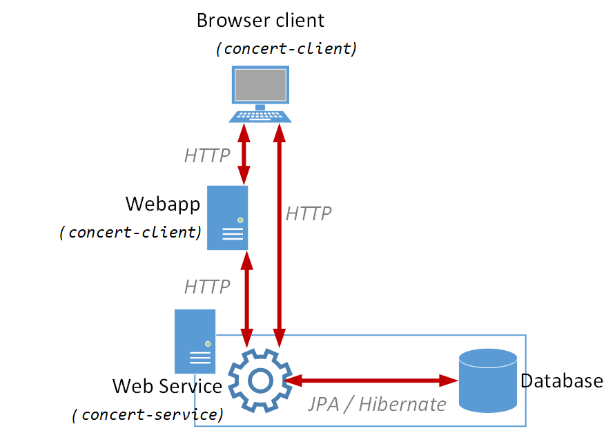
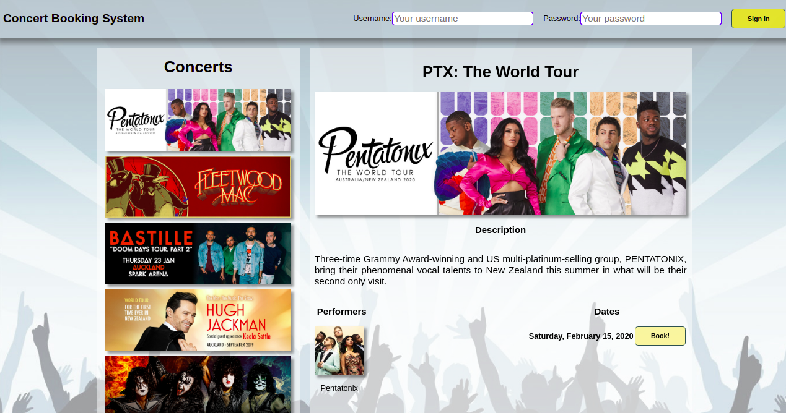
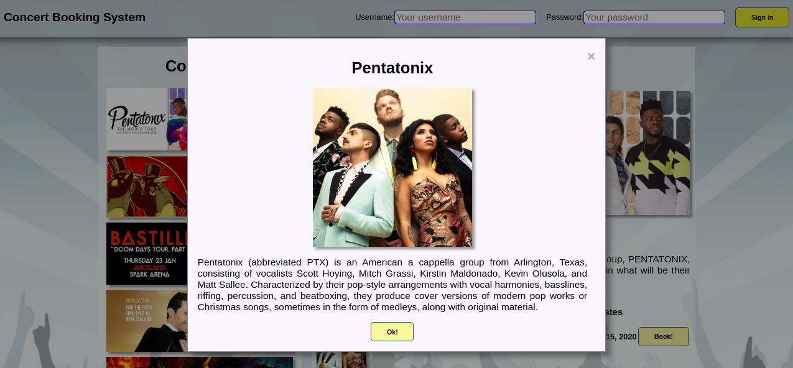
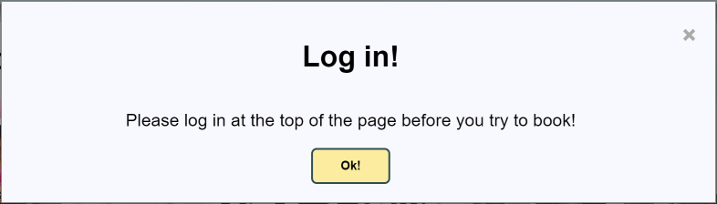
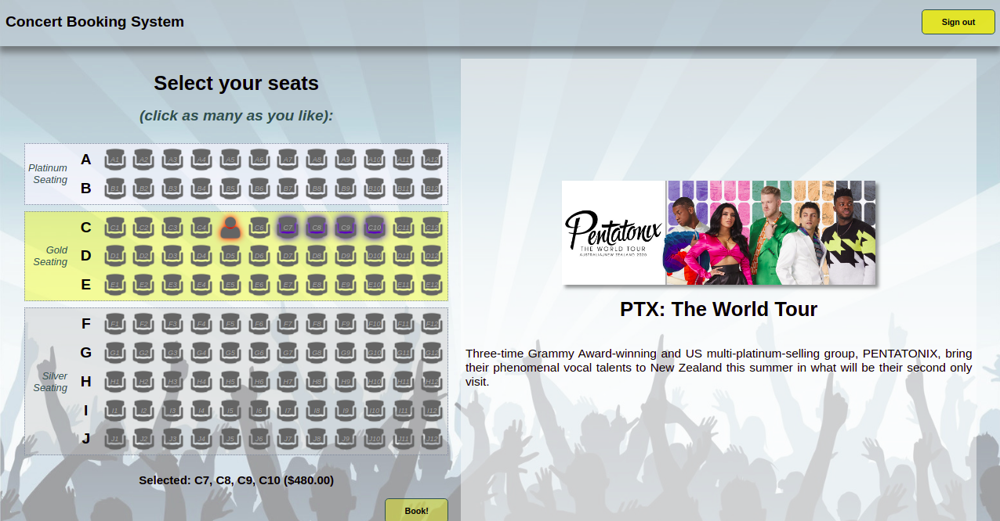
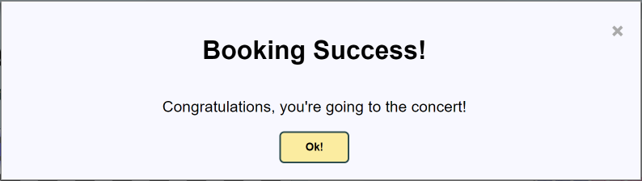

Project - A Concert Booking Service
==========

The aim of this project is to build a Web service for concert booking. 

System description
----------
A booking service is required for a small venue, with a capacity of 120 seats. The venue's seats are classified into three price bands, Silver, Gold and Platinum. A concert may run on multiple dates, and each concert has at least one performer. Additionally, a performer may feature in multiple concerts.

The service is to allow clients to retrieve information about concerts and performers, to make and enquire about seats and reservations, and to authenticate users.

When making a reservation, clients may enquire about available seats. They should be informed of any unbooked seats, along with their pricing. Clients may select any number of seats to book. When making a reservation request, double-bookings are not permitted. Only one client should be allowed to book a given seat for a given concert on a given date. Clients may not make partial bookings - either *all* of a client's selected seats are booked, or *none* of them are.

Clients may view concert and performer information, and enquire about available seating, whether or not they are authenticated. When authenticated, clients gain the ability to make reservations, and to view their own reservations. Clients should never be able to view the reservation information for other guests.

In addition, clients should be able to subscribe to information regarding concert bookings. Specifically, they should be able to subscribe to "watch" one or more concerts / dates, and be notified when those concerts / dates are about to sell out.

A particular quality attribute that the service must satisfy is scalability. It is expected that the service will experience high load when concert tickets go on sale. 

Tasks
----------
#### 1) Construct a domain model
Develop an object-oriented domain model for the concert service. The model should include appropriate classes and relationships that allow concerts, performers, reservations and users to be represented. The classes should be suitably annotated with JPA annotations to define their mapping to a relational schema.

#### 2) Develop a RESTful Web service
Develop a JAX-RS Web service that exposes the required functionality. In developing the service, you should define an appropriate REST interface in terms of resource URIs and HTTP methods.

#### 3) Document some design choices and the organisation of your team
Create a document named `Organisation.md` containing the following details:

- Summary of what each team member did and how the team was organised.
For example, the team may discuss the domain model together but only
one person implements. This will mean we might only see commits from that
person, and wonder if the other members were involved. A short explanation
in `Organisation.md` will help this. It could be a couple of sentences for each member or a simple *All members participated about the same for everything* (in which case the logs should reflect this).
- Short description of the strategy used to minimise the chance of
concurrency errors (2-3 sentences)
- Short description of how the domain model is organised (2-3 sentences)

Points to consider
----------

To check your understanding of the various concepts used in this project, you should consider the following:

1. How have you made an effort to improve the *scalability* of your web service?

2. What (implicit and explicit) uses of *lazy loading* and *eager fetching* are used within your web service. Why those uses are appropriate in the context of this web service? 

3. How have you made an effort to remove the possibility of issues arising from concurrent access, such as double-bookings?

4. How would you extend your web service to add support for the following new features?:

   - Support for different ticket prices per concert (currently ticket prices are identical for each concert)

   - Support for multiple venues (currently all concerts are assumed to be at the same venue with an identical seat layout)
   
   - Support for "held" seats (where, after a user selects their seats, they are reserved for a period of time to allow the user time to pay. If the user cancels payment, or the time period elapses, the seats are automatically released, able to be booked again by other users).

**Important Note:** Recording the above information as well as your overall project development experience will help in completing the Assignment 1 tasks too. Assignment 1 will be released in the second half of the course.

Resources
----------
A multi-module Maven project, `project-concert`, is supplied and comprises 3 modules: 

- `concert-client`. A module that contains resources for building a concert client application.

- `concert-common`. This module defines several entities that are shared by the `client` and `service` modules.

- `concert-service`. The `service` module is responsible for implementing the Web service and persistence aspects of the concert application.

The parent project's POM includes common dependencies and properties that are inherited by the 3 modules.

#### System architecture
The system as a whole is a *tiered* architecture, in which a browser application, driven by a *web app*, communicates via HTTP with the *web service* you will create for this project. A high-level overview can be seen in the below diagram:

#### Client module
The client module contains a *web application*, built using technologies such as HTML5, CSS, JavaScript, JSP, and JSTL. This web application is capable of acting as a *client* to the web service which you will create for this project, as shown in the diagram above. The client contains both browser-based and server-based code (written in JavaScript and Java, respectively) which communicate with the `service` layer over HTTP.

The client is intended to be a demonstration of the kind of web application that can be powered by the web service you will create. You will not need to modify the application, other than potentially altering the value of `Config.WEB_SERVICE_URI`, but the application can be used as part of your testing.

#### Common module
This module includes a number of packages:

- `proj.concert.common.dto`. This package contains complete implementations for 7 DTO classes. The `client` webapp above, and the integration tests (see below), are defined in terms of the DTO classes.
	
- `proj.concert.common.jackson`. This package includes the Jackson serializer and deserializer implementations for Java's `LocalDateTime` class.

- `proj.concert.common.types`. This package defines basic data types that are common to the `client` and `service` modules. The types comprise 2 enumerations: `Genre` (for performers), and `BookingStatus` (for querying available / unavailable seats).

#### Service module
The `service` module will contain your completed Web service for the project. It contains the following packages:

- `proj.concert.service.domain`. This package will contain the web service's completed domain model. Currently it includes two **incomplete** classes - `Concert` and `Seat`. These two classes must be completed, and any other domain classes you deem necessary should be added.

- `proj.concert.service.jaxrs`. This package contains the `LocalDateTimeParam` class. This class allows us to receive `LocalDateTime` instances as *query* or *path* parameters, which may prove useful when implementing your web service. For a detailed description, be sure to read the class's comments.

- `proj.concert.service.mapper`. This package is intended to contain mapper classes, which map between your domain and DTO classes.

- `proj.concert.service.services`. This package contains the `ConcertResource` class, which you must implement for this project. It also contains a `PersistenceManager` class which can be used to obtain `EntityManager` instances when required, a complete `ConcertApplication` class, and a `TestResource` class which implements a web service endpoint to reset the database. This is used for testing purposes.

- `proj.concert.service.util`. This package contains the `ConcertUtils` class, which can re-initialize the database, and the `TheatreLayout` class, which can be used to generate `Seat`s for a particular concert date.

Beyond packages and source files, the `service` module contains the JPA `persistence.xml` file, a database initialise script (`db-init.sql`) and a `log4j.properties` file (in `src/main/resources`). Finally, integration tests are included in the `src/test/java` folder. As usual, these tests may be run by executing Maven's `verify` goal on the parent project, and a 100% pass-rate (along with correct client functionality) is a good indication that your service implementation is correct.

The `persistence.xml` file includes a `javax.persistence.sql-load-script-source` element whose value is the supplied`db-init.sql` script. The effect of this element is to run the script when the `EntityManagerFactory` is created.`db-init.sql` file populates the database with concert and performer data.

Constraints
----------
You are not permitted to change the `ConcertServiceIT` class. Since these integration tests rely on the DTO classes in package `proj.concert.common.dto`, and the data types in package `proj.concert.common.types`, you cannot change these entities either - except to add any required annotations.

Your solution must load the data as described by the `db-init.sql` file (i.e. you must have the 2 users, 11 performers, 8 concerts, all 11 supplied concert-performer pairings and all 13 concert dates). Failure to do so will result in the integration tests failing, which will negatively impact your grade. As such, when defining JPA annotations, ensure that you supply all table and column names as appropriate.

While your Web service doesn't need to be tested with concurrent clients, it *does* need to be implemented in such a way that it could be used by concurrent clients without comprising data integrity.

Finally, your solution must function, with the given client webapp, without modifying any source files in the `client` package (with the exception of the `Config` class if necessary).

Hints and Suggestions
----------
- **Jackson annotations**. Recall that some properties on your DTO classes will need to be annotated in order to be marshalled / unmarshalled correctly as JSON. This is the only change you are required to make to the DTO classes (and, indeed, the only change you're *allowed* to make).

- **Domain model design**. In designing the domain model, you should consider its impact on scalability. When the Web service is under heavy load by users wanting to book concerts, the domain model shouldn't constrain throughput because of coarse-grained concurrency control schemes.
	
- **Domain modelling of users, concerts and performers**. The supplied `db-init.sql` file populates relational tables with data about users, concerts information (including dates), performers, and which concerts feature which performers. To use the script without modification as required, you might want to work backwards from the tables and define `Concert`, `Performer` and `User` entity classes, annotated appropriately, such that the JPA provider generates the schema expected by the `db-init.sql` script. Your domain model would then need additional classes to fully meet the system's requirements. 
	
- **Token-based authentication**. The web service specification sometimes calls for an authenticated user. Authentication should be implemented using *token-based authentication*, which is where the client exchanges credentials (username and password) for a token. Once authenticated, the client sends the token with each subsequent request to the web service. For any requests requiring authentication, the Web service checks for the presence of the token. If the token's missing, the request fails; if the token doesn't identify a user (based upon accessing storage to lookup any user to whom the token is associated), the request fails. Where the token is bound to a particular user, the user is then authenticated, and the web service may then determine whether the user is authorised to make the request.
	
- **Returning appropriate HTTP status codes**. There are several HTTP status codes that are defined by the HTTP specification. While there isn't complete agreement on which codes to use in REST-based Web services, the following conventions are widely accepted.
	
   - `200 OK`. This is appropriate where a request has been successfully processed, and the HTTP response message's body contains entity data.
   
   - `201 Created`. This response is appropriate where a request to create a new resource has been successful. The response message should contain a `Location` header storing the URI of the newly created resource.
   
   - `204 No Content`. Similar to `200 OK`, but where the corresponding HTTP response message doesn't contain entity data.
   
   - `400 Bad Request`. This is suitable where a client makes a bad request, e.g. where a DTO argument is expected to have particular fields filled in but doesn't, or where the combination of field values don't make sense, e.g. a concert reservation request specifies a date when the concert isn't scheduled.
   
   - `401 Unauthorized`. In practice, a `401 Unauthorized` status code is used to indicate that the requesting client/user was not *authenticated* (as opposed to not *authorized*, e.g. based on having insufficient access rights). Where a web service request that requires an authentication token lacks the token, a `401` code is thus appropriate.
   
   - `403 Forbidden`. Whereas `401` indicates a user who is not authenticated, `403` indicates a user who *is* authenticated, but is not *authorized* to perform a certain operation. In our case, this might include attempting to view another user's bookings, or book seats which have already been acquired by another user.
   
   - `404 Not Found`. This is appropriate where a named resource doesn't exist in the Web service.
   
   - `500 Internal Server Error`. Where an error other than an application condition has occurred in processing a Web service request, a `500` status code is appropriate.

- **Specification**. You should consider the unit tests and comments provided in the `ConcertResourceIT` class to be the formal specification for the web service. Carefully study the expected endpoints, request parameters, and response parameters.

- **Building the project and running the supplied integration tests**. As usual, running Maven's `verify` goal on the parent project will:

   1. cause the project to be compiled and packaged.
   
   2. Assuming compilation is successful, a Jetty server will be automatically started, and your WAR file(s) deployed.
   
   3. All integration tests (JUnit tests with an `IT` suffix) will then be run against the Jetty server.
   
   4. Finally, the Jetty server will be terminated, and any results reported. **You may need to scroll through the printed logs to find the actual failures which occurred, if any**.
   
    
   **Note:** The final 5 (out of 6) tests in `ConcertSubscriptionIT` - which test the *publish / subscribe* feature introduced in the system description - take some time to run. You may want to disable them in the early stages of your development, but ensure you re-enable them when you begin developing your async functionality.
   
- **Logging**. You may adjust the `log4j.properties` files as you see fit, to view more or less logging information as required for your testing.

Assessment and submission
----------

#### Submission

The marking of this lab will mainly be based on your team repository as of
**Monday May 9 0900hrs**. 

The submission for this lab will follow the same final step as for labs, which means you will be creating a **"submission"** branch and push your final code to that branch for submission. Note that as for labs this must be done once you are fully satisfied with your code and have successfully tested your code locally. Again, **only 3 attempts** for pushing to "submission" branch are allowed. Except for this, there are no other rules for how you manage your branching for this lab. After you have finished all exercises and pushed the code to the repository on Github, please check if the execution of `Github classroom workflow` runs successfully without any test fails.

Your submission must include a file `Organisation.md` containing the
list of members in your team and a brief summary of what role each member
played. **If this file is not provided then NO marks will be awarded for some components of the mark (see below).**

#### Assessment
This project is worth **30%** of your final grade. It is marked out of **80 marks**, as per the following rubric:

- All unit tests, other than the publish / subscribe tests, pass as expected: **24 marks** (1 mark per test).

- The `client` webapp runs as expected with your web service: **6 marks** (The marker will ensure the client is appropriately deployed - you are not required to do this).

- The five publish / subscribe tests pass as expected: **10 marks** (4 marks each for `testSubscription()` and `testSubscriptionForDifferentConcert()`, 2 marks for the other three tests combined).

- A strategy has been employed to minimise the chance of concurrency errors such as double-bookings: **5 marks** (marks awarded varies based on the strategy chosen). If no `Organisation.md` file is provided, or it does not contain the relevant information, then a mark of **zero** will be given for this component.

- Domain model: **5 marks** (marks awarded varies based on your appropriate use of features such as eager vs lazy fetching & cascading, and the general quality of the domain model). If no `Organisation.md` file is provided, or it does not contain the relevant information, then a mark of **zero** will be given for this component.

- Code review: **5 marks** (code is understandable and well-commented; no obvious errors that may have been missed by the integration tests). 

- Teamwork: **25 marks** Clear evidence that every member in the team has
  contributed to the project. This will be assessed by examining the **code, commit logs, Organization.md, comments recorded in GitHub Discussions and other
information associated with your team repository**. If we do not find evidence of individual contributions to the team work, marks will be deducted for this component.

    We expect to see non-trivial commits, with meaningful commit
    messages. Different team members will do different things and different
    times, but we will be looking for evidence that there was communication, cooperation and
    collaboration. The suggested evidence for this remains at the least same as previous labs. 

    **All members of the team will get the same mark for the project, unless one or more members have clearly not contributed enough towards the project.** As mentioned earlier, it will be each team member's responsibility to convince the markers about their contributions toward the project. If you are face any team issues, talk to the members involved and/or to the lab tutors during the lab sessions. Remember there is a project help lab session throughout Week 6 too.

    If no `Organisation.md` file is provided, or it does not contain the relevant information, then a mark of **zero** will be given for the team component.

    **You must enter your initial team communication via GitHub Discussions before Thursday, 31 March 17:00hrs NZ time**. Some examples of this evidence could be: who does what,  	by when you plan to finish the exercises, constraints, planning notes, etc. Additionally, feel free to use GitHub Issues to report and discuss specific issues that you face 	while working on the exercises. If you end up using both Discussions and Issues, clearly state this in Organization.md. If you fail to add any notes to Discussions before the 	   Initial Team Communication deadline, **10 marks** will be deducted from the Teamwork marks.

    **Note that your team (one of the team members to push on behalf of the team) must NOT push to the "submission" branch on remote (GitHub repo) more than 3 times**. Executing 	workflows incurs cost, and you must make sure you do not violate this rule while making your submissions. **Violating this rule will bring penalties too**. To be safe, 	never push to submission branch unless you have fully tested your final code. See details in previous lab descriptions.
    
    **CAUTION: Avoid the following scenarios**
    
    - One or more members provides negligible contribution to the project. Make sure each member contributes.
    - One or more members are too fast in approaching/completing the project, not prepared to wait for the rest. Slow down if all cannot cope.
    - One or more members work to finish the project tasks themselves without consulting the rest. Take the team along! Maintain your communication.
    - One or more members have schedule issues and so cannot work together on the project. Plan your schedule well in advance (Week 4).
    - Others??

Appendix: The client webapp.
----------
The `concert-client` project contains a complete web application which is designed to communicate with your web service from both its server-side (Java) and client-side (JavaScript) code, to deliver its functionality.

#### App usage
Using the application, browsing to `/Concerts` or simply `/` (within the webapp's *context*) will present the "homepage" of the app, allowing the user to view concerts. On this page, users may scroll through the list of concerts on the left side of the page. Clicking on a concert will cause that concert's info to be displayed in the detail view.

On the detail view, users can see more information about the currently selected concert, as well as a list of performers and dates for that concert.

Clicking on a performer's image will display a modal dialog containing more information about that performer:

If the user hasn't logged in, then clicking on the "Book!" button next to one of a concert's dates will prompt the user to sign in:

If the user has already signed in, they will be redirected to the seat selection page for their selected concert and date. See `concert-service/src/main/resources/db-init.sql` for the data that the server is initialised with, including possible users and their passwords.

Here, users can see a visual seat map of the venue, along with an indicator of which seats have already been booked. Clicking unbooked seats will toggle a blue halo around that seat - an indicator that the seat has been selected for booking, as can be seen in the above screenshot. A list of selected seats - along with the total ticket price - can be seen below the seat map.

Once the user has made their selection, they can click the "Book!" button. Assuming they have "sufficient funds" (which will always be true for this test case), and that no other user has booked the same seats in the meantime, the user will be presented with a success dialog box:

Dismissing the dialog will redirect the user back to the concerts page, where they may continue to book tickets at other concerts / dates. (or more tickets for the same concert / date).

#### Limitations
The webapp currently *partially* exercises the web service you are required to create for this project. Functionality for a user to view their bookings is not implemented, though this is required by the web service specification. Additionally, the webapp does not participate in the *publish / subscribe* functionality required of the service.

#### Running the complete system
The only way to run the complete system is to package both the `client` and `service` projects into `WAR` files, and deploy them to a running servlet container such as Tomcat.

Fortunately, running Maven's `package` goal on the parent project will build both WARs as required. However, we will still need to set up a Tomcat (or similar) instance to run the application.

Whichever IDE you use, the first step will be to download a Tomcat installation, if you don't already have one. You can find them [here](https://tomcat.apache.org/download-80.cgi). Get version `8.5.x` as an archive (the installer isn't required), download and unzip it somewhere on your machine, and then follow the steps below according to your IDE.

**Warning** There seem to be a number of variations in IDE setup and installation, so what's below may not work for your particular setup. You may need to explore google to find workable alternatives. [Tomcat-CL](Tomcat-CL.md) has a simplified attempt for doing it from the command line.

#### From Eclipse
**Note: This only works with Eclipse for Java EE Developers, with Tomcat support enabled**. If you don't see any of the options mentioned here, it's likely that you don't have these options. You can get them through the *Help* &rarr; *Install new software* menu, searching for *Java EE* and *Tomcat*, respectively. Alternatively you could try using the 
[marketplace](https://marketplace.eclipse.org/content/eclipse-java-ee-developer-tools-0) directly.

1. Open *Window* &rarr; *Preferences*, then choose *Server* &rarr; *Runtime Environments*. Click *Add*, then choose the Apache Tomcat version matching the one you downloaded (which should be v8.5 if you're following along).

2. Click *Next*, then browse to where you unzipped Tomcat. Click *Select folder*, then *Apply and Close*.

3. Next, open the *run configurations* menu (the small dropdown arrow next to the green Play button). Locate *Apache Tomcat*, and double-click to create a new run configuration.

4. Go to the *Servers* View. if it's not on-screen, open it with *Window* &rarr; *Show view*. Create a new Tomcat server of matching version, and click *Finish*.

5. Right-click the newly created server, and choose *Open*. here, you can configure the *HTTP/1.1* port on the right (say, to 10000). Save the config (`Ctrl+s`).

6. In the above menu, you can also see / change the *Server path* and *Deploy path*. the default is something like `.metadata\.plugins\org.eclipse.wst.server.core\tmp0\wtpwebapps` - which you can use, or you can change it to anywhere on your machine. Again, save the config.

7. Run maven's `package` goal to create the WARs if you haven't already done so.

8. Rename the `client` WAR to `concert-webapp.war`, and the `server` WAR to `webservice.war`. This will prevent you from needing to make changes to `Config.java` and `fetch-api.js` in the `client` project. Alternatively, you may make the changes to these files as required.

9. Start the server running. (right-click it to get the option).

10. In a file explorer, browse to the server path / deploy path as in step 6 - except, locate the `webapps` folder, rather than `wtpwebapps`.

11. Copy / paste your WARs into the `webapps` folder. If the server is started, you should notice folders shortly being created by Tomcat. And, you can see Tomcat's logging output from the Eclipse console.

12. Browse to the appropriate URL from your browser (which should be <http://localhost:10000/concert-webapp/> if you've followed along), and enjoy.

13. When you make modifications and repackage your WARs, you can delete the contents of the `webapps` folder and re-copy your new WARs over (while the server is stopped).

#### From IntelliJ
**Note: This ONLY works in IntelliJ Ultimate edition.** Community edition does not support this. Having said that, Ultimate edition is available for free for educational use. Simply sign up for a new account using your University email address.

1. Within your project, open the *Run Configurations* dialog (usually available in the top-right corner, or open the search box by tapping double-shift, then type "run configurations"). Either way, pick *Edit Configurations*.

2. Click on the **+** button on the top-left of the dialog, then choose *Tomcat server* &rarr; *Local*.

3. Name the configuration whatever you like. For the *HTTP Port*, pick one which is available on your machine, such as *10000*.

4. For the *application server*, pick one from the list. If none are available, click *configure*. You'll be able to add one (by browsing to the location where you downloaded Tomcat earlier).

5. Under the *Deployment* tab, select both WAR artifacts (`client` and `service`) for deployment - these would have been created by IntelliJ's Maven integration (you shouldn't select the *exploded* versions, but it probably doesn't matter). For the application context, set the `service` WAR's context to `/webservice`, and the `client` WAR's context to `/concert-webapp`.

6. Go back to the *Server* tab. Edit the *URL* to be `http://localhost:10000/concert-webapp/` (altering the port as necessary). Then, click `OK`.

7. In the `client` project, open `src/main/java/.../Config.java`, and edit the `WEB_SERVICE_URI` field as appropriate (assuming port `10000`, and the contexts identified in step 5 above, you won't need to change this).

8. In the `client` project, open `src/main/webapp/js/fetch-api.js` and edit `WEB_URI` as appropriate (assuming the contexts identified in step 5 above, you won't need to change this).

9. From the *run configurations* dropdown, slect your new configuration and click the *play* button. The webapp and web service should start, and the browser should eventually open at the URL identified in step 6 above. If it doesn't, you can browse there manually.

10. When you're done, hit the *stop* button. Sometimes you may need to click it twice (do so until the stop button is greyed out, and you see a *Disconnected from server* message in the server output).
