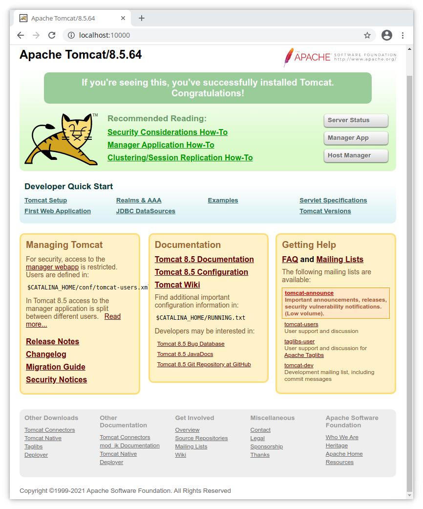

##Setting up Tomcat

This is intended to provide a very brief set of instructions for manually
setting up a [Tomcat](https://tomcat.apache.org) server from the command line
for the project (as an alterantive to what's given in the  for the project). These do not cover all possibilities so if they don't appear
to work, look at documents provided with the Tomcat distribution (start with
the `README.md` file).

### Prepare.

These instrutions assume:

* You understand how to set environment variables for your operating system and shell

* Java (version 7 or later) is installed and the environment variable JAVA_HOME is set to the location of the Java installation.

* You are operating on some version of linux (although these should work for MacOS, and some windows alterantives are mentioned but should be used with caution)

### Download

Download the Tomcat archive file (`zip` or `tar.gz`) from 
[here](https://tomcat.apache.org/download-80.cgi)

### Install Tomcat

1. Go to an appropriate directory (e.g. `/opt`). Call this directory INSTALL_ROOT. 

1. Unpack the archive file in INSTALL_ROOT. This will create a directory with a name like `INSTALL_ROOT/apache-tomcat-VERSION`.

1. Set the environment variable CATALINA_HOME to INSTALL_ROOT/apache-tomcat-VERSION (the location of the root directory for the Tomcat installation)

1. Set the permissions of `CATALINA_HOME/bin/catalina.sh` (or `CATALINA_HOME\bin\catalina.bat`) to be executable (if necessary - sees ok in the `tar` distribution)

1. Change the port the server will listen to from the default 8080 to 10000.

    1. Edit `CATALINA_HOME/conf/server.xml`
    1. Find the `Connector` element (or just search for `8080`)
    1. Change the value `8080` to `10000`

1. Execute the command `CATALINA_HOME/bin/catalina.sh start` (or `CATALINA_HOME\bin\startup.bat start`). You should see something like:
<pre>
    Using CATALINA_BASE:   /opt/apache-tomcat-8.5.64/
    Using CATALINA_HOME:   /opt/apache-tomcat-8.5.64/
    Using CATALINA_TMPDIR: /opt/apache-tomcat-8.5.64//temp
    Using JRE_HOME:        /opt/java/java_home
    Using CLASSPATH:       /opt/apache-tomcat-8.5.64//bin/bootstrap.jar:/opt/apache-tomcat-8.5.64//bin/tomcat-juli.jar
    Using CATALINA_OPTS:   
    Tomcat started.
</pre>
    
1. In a web browser, visit `http://localhost:10000/`. You should see something like:

    

### Install Concert Webapp

1. Change your working directory to `proj-concert`, that is the top level of the project (where the parent `pom.xml` file is).

1. Run Maven's `package` goal: `mvn package`
1. You should now have the files
`proj/concert-client/target/concert-client-1.0.war`
`proj/concert-service/target/concert-service-1.0.war`

    Copy `concert-client-1.0.war` to `CATALINA_HOME/webapps/concert-webapp.war` and `concert-service-1.0.war` to `CATALINA_HOME/webapps/webservice.war` (note the names of the files get changed),

1. If your Tomcat server is running then it should pick up the fact that the `war` files have been added to its `webapps` directory, and so when you visit `http://localhost:1000/concert-webapp` you should see:

    

